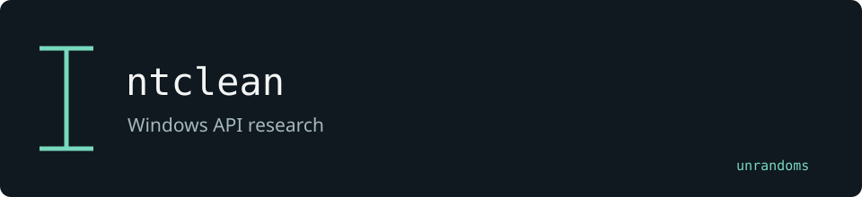

# ntclean

A Windows API research fork derived from Celeborn. Its source explores loaded-module inspection and modification.

Maintained by [unrandoms](https://github.com/unrandoms), derived from [frkngksl/Celeborn](https://github.com/frkngksl/Celeborn).

## Fork-specific work

- [`Main.cpp`](Main.cpp)
- [`Structs.h`](Structs.h)

## Validation and limits

This project changes process memory. No claim of reliability, invisibility or production readiness is made. Its Windows runtime has not been validated in this review.

This documentation update does not certify all inherited features. The [archived reference](UPSTREAM_README.md) describes the original ecosystem; its package names and release links may target upstream rather than this fork.

## Credits

See [CREDITS.md](CREDITS.md) for the distinction between the original implementation and this fork's adaptations. Original licenses and copyright notices remain in the repository.
